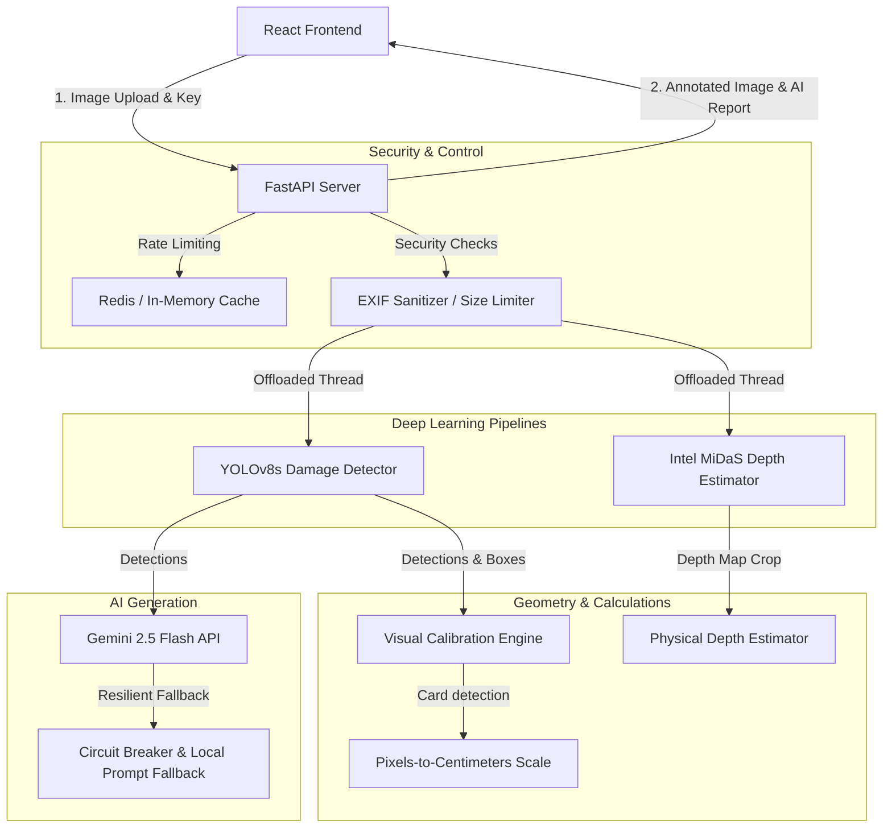

# 🚗 Vehicle Damage Detection & Diagnostic Visualizer (Overbody)

A production-grade, secure, and highly scalable Computer Vision and Generative AI system designed to detect vehicle exterior defects, estimate physical dent depth using monocular depth maps, and output custom AI repair guidance reports.

Built with a **FastAPI** backend and an **interactive React + TypeScript (Vite)** dashboard.

---

## 🏗️ System Architecture



---

## 🏁 Beginner Quick-Start Guide

### 1. Prerequisites
*   **Python**: Version `3.10` to `3.13`
*   **Node.js**: Version `18+` (with `npm`)

### 2. Backend Setup
1. Open a terminal and navigate to the backend directory:
   ```bash
   cd backend
   ```
2. Create a virtual environment:
   ```bash
   python -m venv .venv
   ```
3. Activate the virtual environment:
   *   **Windows (PowerShell)**: `.\.venv\Scripts\Activate.ps1`
   *   **macOS / Linux**: `source .venv/bin/activate`
4. Install backend dependencies:
   ```bash
   pip install -r requirements.txt
   ```
5. Create a `.env` file in the `backend/` directory:
   ```env
   # Secure API Keys (Comma-separated for multi-user support)
   SECURE_API_KEYS=your_shop_key_1,your_shop_key_2
   
   # Gemini Developer Key
   GEMINI_API_KEY=AIzaSy...
   
   # Optional Redis rate limiting (leave empty to fallback to in-memory)
   REDIS_URL=redis://localhost:6379/0
   
   # Allowed CORS origins
   ALLOWED_ORIGINS=*
   ```
6. Run the FastAPI development server:
   ```bash
   .\.venv\Scripts\uvicorn main:app --reload --port 8000
   ```

### 3. Frontend Setup
1. Open a new terminal and navigate to the frontend directory:
   ```bash
   cd frontend
   ```
2. Install npm packages:
   ```bash
   npm install
   ```
3. Run the Vite development server:
   ```bash
   npm run dev
   ```
4. Open your browser and navigate to `http://localhost:5173/`.

---

## 📝 API Specification (v1)

### 1. Damage Analysis Endpoint
*   **URL**: `/api/v1/analyze`
*   **Method**: `POST`
*   **Headers**: `X-API-Key: your_shop_key_1`
*   **Payload**: Multipart form-data with a file field `"file"`.
*   **Response (200 OK)**:
    ```json
    {
      "success": true,
      "overall_severity": "Moderate",
      "summary": {
        "Mild": 1,
        "Moderate": 1,
        "Severe": 0
      },
      "calibration": {
        "cm_per_pixel": 0.041,
        "reference_found": true
      },
      "damages": [
        {
          "id": 1,
          "class": "dent",
          "severity": "Moderate",
          "confidence": 0.86,
          "box": [120, 240, 150, 110],
          "estimated_depth_cm": 1.2,
          "panel": "Front Bumper"
        }
      ],
      "annotated_image": "data:image/jpeg;base64,...",
      "repair_guide": "## Repair Guidance\n- **Front Bumper Dent**..."
    }
    ```

### 2. Print Report HTML Export
*   **URL**: `/api/v1/export-report`
*   **Method**: `POST`
*   **Payload**: The JSON output of `/api/v1/analyze`.
*   **Response**: A fully styled, print-ready HTML page representing the audit report.

### 3. Health & Monitor Endpoint
*   **URL**: `/api/v1/health`
*   **Method**: `GET`
*   **Response**: Returns CPU/RAM metrics and neural network loaded states.

---

## 🧠 Advanced Technical Architecture & Code Deep Dive

### 1. Asynchronous Model Scaling
To prevent long-running inference requests from blocking FastAPI's single-threaded event loop, all model executions (YOLOv8, MiDaS depth predictions) are offloaded onto separate threads using AnyIO's threadpool:

```python
from anyio import to_thread

# Offloaded thread runner executes model synchronously on background worker threads
detections = await to_thread.run_sync(
    detector.predict, temp_file_path
)
```

### 2. Visual Calibration Engine (OpenCV)
Calculates physical size scaling factor using a standard credit card (ISO/IEC 7810 size: `8.56 cm x 5.398 cm`) as a calibration object:
*   Filters green-hued contours (`HSV` color space check).
*   Finds the bounding rectangle of the card.
*   Calculates centimeters per pixel:
    $$\text{cm\_per\_pixel} = \frac{8.56}{\max(\text{card\_width\_pixels}, \text{card\_height\_pixels})}$$

### 3. Dent Depth Estimation (Intel MiDaS)
Calculates physical indentation depth from a monocular 2D crop:
1. Normalizes raw depth prediction map values between `0.0` (farthest) and `1.0` (closest).
2. Calculates the 95th and 5th percentile relative range difference to exclude sensor noise.
3. Scales the relative deformation against the bounding box's maximum dimension to estimate physical depth:

```python
# Physical depth is scaled proportionally to the component size in centimeters
depth_cm = relative_range * max_physical_dimension_cm * 0.12
```

### 4. Interactive Damage Ruler (Frontend Screen Translation)
To draw custom measurements, clicks on the displayed screen bounding rect are translated back to natural image coordinates to calculate physical distance:

```typescript
// Translate client-click coordinates to original image pixels
const rect = imgRef.current.getBoundingClientRect();
const clickX = e.clientX - rect.left;
const clickY = e.clientY - rect.top;

const originalX = (clickX / rect.width) * imgDim.nw;
const originalY = (clickY / rect.height) * imgDim.nh;

// Euclidean pixel distance
const pxDist = Math.sqrt(Math.pow(dx, 2) + Math.pow(dy, 2));
const physicalDistCm = pxDist * cm_per_pixel;
```

### 5. Resilient AI Guidance (Circuit Breaker Pattern)
To ensure the application functions perfectly even if external API limits are exceeded or internet connectivity drops, the Gemini service incorporates a circuit-breaker:
*   **Healthy State**: Sends vehicle panel and damage data to Gemini to get tailored repair instructions.
*   **Tripped State**: If Gemini fails 3 consecutive times, the system switches to offline fallback rule generation (reloading automatically after 60 seconds).

---

## 🧪 Test Suite

The system includes comprehensive integration tests verifying file size limits, rate limiting, and deprecated endpoint compatibility:
```bash
# Set Python path and execute pytest
cd backend
$env:PYTHONPATH="."
.\\.venv\\Scripts\\pytest tests/
```

---

## 🐳 Docker Deployment

The application is containerized with support for local Redis cache integration:
```bash
# Build and run containers in background
docker-compose up --build -d
```

---

<!-- DEVHUB-GITHOOKS:START (managed by rollout) -->
## Git Hooks & Pre-Commit Checks

This repo is pre-configured with the DevHub git hooks — every `git commit` is automatically scanned (gitleaks, detect-secrets, Semgrep, Ruff, Biome, terraform fmt, repo hygiene).

### First-time setup

Run **once** after cloning — installs the tools and activates the hooks:

**Windows (PowerShell):**
```powershell
.\tasks\mise-install.cmd
```

**macOS / Linux / Git Bash:**
```bash
bash tasks/mise-install.sh
```

> Run this **before committing** — until you do, your commits are blocked. If `mise` was just installed, open a new terminal first.

### Get the hooks into an existing branch

These hooks are merged into `main`/`master`. To pull them into a branch you already have, **rebase onto the latest `main` and re-run setup**:

```bash
git checkout main
git pull origin main
git checkout your-feature-branch
git rebase main
.\tasks\mise-install.cmd      # Windows  (bash tasks/mise-install.sh on macOS/Linux)
```

### Run the checks manually

```bash
mise scan
```

### Troubleshooting — hook ignored on macOS / Linux

If a commit goes through **without** the checks running, Git skipped the hook because it isn't executable:

```
hint: The '.githooks/pre-commit' hook was ignored because it's not set as executable.
```

Setup (`mise-install.sh`) marks the hooks executable, but if you still hit this, fix it manually — the executable bit is tracked by Git, so committing it keeps the gate working for everyone who clones:

```bash
chmod +x .githooks/*
git add .githooks/
git commit -m "chore: make git hooks executable"
```

Verify: `ls -la .githooks/` shows `-rwxr-xr-x`, and `git config core.hooksPath` prints `.githooks`.
<!-- DEVHUB-GITHOOKS:END -->
