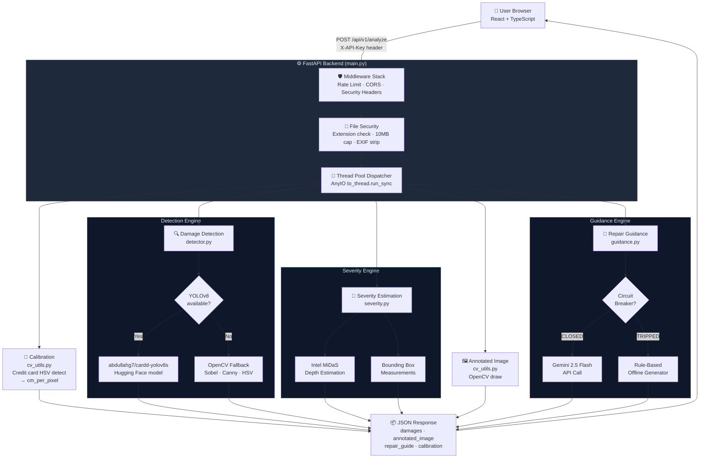
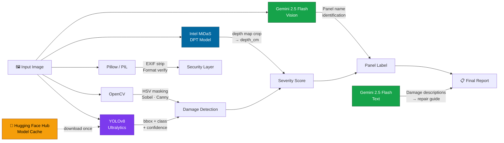
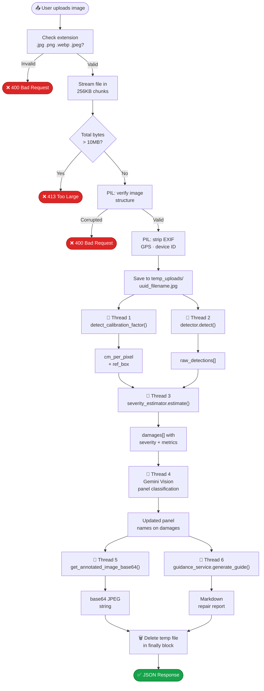
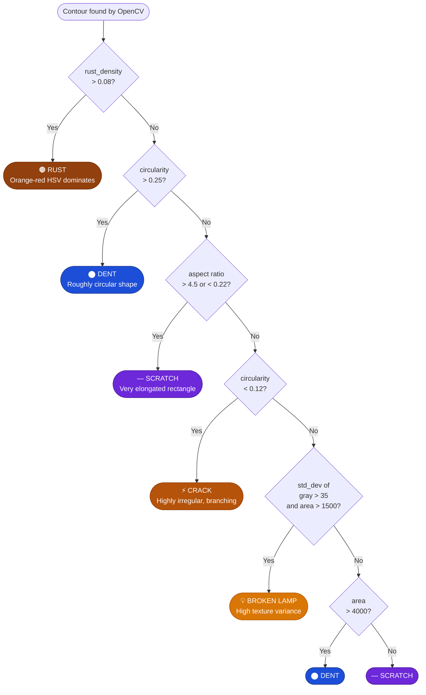
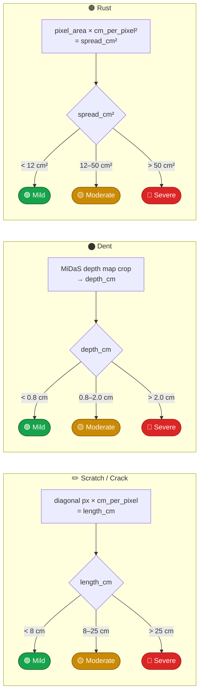
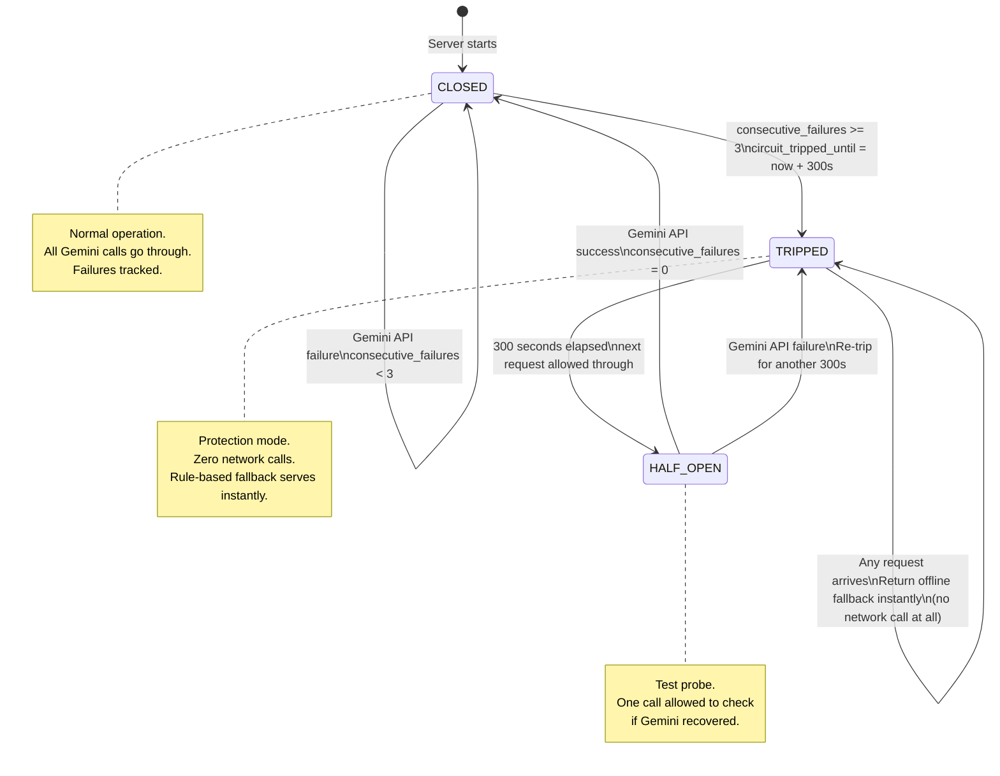

# 🧠 Overbody — Personal Deep-Dive Understanding Document

> *This document is written for you, personally. It explains not just what the code does, but why every single decision was made, why this project matters, and how each piece fits together. Read this before you touch anything.*

---

## 1. WHY THIS PROJECT EXISTS

### The Real Problem in the Automotive World

Every single day, millions of cars get scratched, dented, or damaged in parking lots, minor accidents, or from environmental wear (rust, UV, hailstorms). When someone needs to get their car repaired, they face a frustrating chain of problems:

1. **No benchmark** — The owner has zero idea how severe the damage is. Is that dent a $200 repair or a $2,000 repair?
2. **No transparency** — They drive the car to a body shop, and the mechanic writes a quote on paper. There is no standardization, no visual proof, no audit trail.
3. **No documentation** — Insurance claims require clear photographic evidence. A manual photo is not enough — you need annotated evidence with class labels, severity, and measurement data.
4. **Time-consuming** — A professional inspector walks around the vehicle, manually photographs each panel, describes each damage in a report, and types it all out. This takes 45–90 minutes per vehicle.

### What This Project Solves

This project reduces that 90-minute audit process down to **under 30 seconds**.

- A person uploads one photo of a vehicle.
- The AI automatically detects all visible defects: scratches, dents, rust, cracks, broken lamps, shattered glass.
- It physically measures the size of each defect using a **credit card** placed near the vehicle as a real-world calibration object (ISO/IEC 7810 — every card in the world is exactly 8.56 cm × 5.398 cm).
- It estimates the physical depth of dents using a 3D depth estimation AI model (Intel MiDaS).
- It generates a structured repair guide with tool lists, step-by-step instructions, and DIY vs. Professional cost comparisons using **Gemini 2.5 Flash**.
- The inspector exports a print-ready HTML/PDF report with all findings in one click.

### Who Uses This?

| User | How They Use It |
|---|---|
| **Independent Car Inspectors** | Pre-purchase vehicle inspection reports |
| **Body Shops & Repair Centers** | Quick, standardized damage quotation |
| **Insurance Adjusters** | Audit-proof annotated damage evidence |
| **Rental Car Companies** | Check-in / check-out damage comparison |
| **Private Car Owners** | Understand severity before visiting a shop |

---

## 🗺️ System Architecture Overview



---

## 2. THE TECHNOLOGY STACK — AND WHY WE CHOSE EACH PIECE

### Backend: FastAPI (Python)

**Why FastAPI and not Flask or Django?**

FastAPI is an **asynchronous** Python web framework. The critical word is *asynchronous*. Our backend runs two extremely heavy AI models: YOLOv8 (runs in ~0.5 seconds) and Intel MiDaS (runs in ~1–2 seconds). If we used a synchronous framework like Flask, every API call would block the server entirely during model inference — the server could not handle any other requests while waiting.

FastAPI, combined with AnyIO's threadpool offloading, solves this perfectly:

```python
# We never block the event loop. Heavy tasks are "offloaded" to background threads:
raw_detections = await to_thread.run_sync(
    detector.detect, temp_file_path   # runs on a background worker thread
)
# FastAPI is FREE to handle new requests while this thread works in the background
```

Think of it this way: FastAPI's event loop is like a restaurant manager — it doesn't cook the food (model inference); it just takes orders and dispatches them to the kitchen (background threads). The manager is always free to take new orders.

---

### AI Detection: YOLOv8 (Ultralytics)

**Why YOLO and not ResNet or EfficientDet?**

YOLO stands for **"You Only Look Once"**. It processes the entire image in a single forward pass through a neural network. That's why it's fast — it doesn't scan the image in multiple passes like older detection networks.

The specific model we use, `abdullahg7/cardd-yolov8s` hosted on Hugging Face, is fine-tuned specifically on car damage images. It outputs bounding boxes (pixel coordinates) plus class labels: `dent`, `scratch`, `crack`, `glass_shatter`, `lamp_broken`.

---

### Depth Estimation: Intel MiDaS

**Why do we need a depth model for a 2D photo?**

A regular camera photo has no physical depth information — it's just color and brightness. You cannot answer "how deep is this dent?" from a flat image alone without **monocular depth estimation**.

Intel MiDaS (Mixed Dataset Mixing and Adapting for Scale) is a neural network trained on millions of stereo image pairs. It learned to infer depth from visual cues like shadows, perspective distortion, and surface curvature — the same cues human eyes use.

```python
# The physical depth formula (from depth_estimator.py):
depth_cm = relative_range * max_dimension_cm * 0.12
# relative_range = normalized 95th-5th percentile depth variation in the crop
# max_dimension_cm = largest bounding box dimension scaled to real-world centimeters
# 0.12 = empirically calibrated constant for real car-panel deformation proportions
```

---

### Calibration: Credit Card Contour Detection (OpenCV)

**Why a credit card?**

A camera's perspective distortion means the same dent looks different in pixel size depending on distance. We cannot estimate physical sizes from pixels without a known reference object in frame.

Every credit card in the world is exactly **8.56 cm × 5.398 cm** (ISO/IEC 7810 standard).

OpenCV detects the card's green-colored rectangle using HSV color filtering, finds its pixel dimensions, and calculates:

```python
pixels_per_cm = max(card_width_pixels, card_height_pixels) / 8.56
cm_per_pixel = 1.0 / pixels_per_cm
```

If no card is found, the system falls back to `0.04 cm/pixel` — the typical ratio for a car photo taken from ~2 metres on a standard smartphone camera.

---

### AI Report Generation: Gemini 2.5 Flash

Gemini 2.5 Flash is **multimodal** — it processes both images (for panel classification: "which part of the car is this?") and text (for the repair guidance report generation). We use it for both purposes. The service includes a **circuit breaker** to protect against rate limits or API failures (see section 3.5 below).

### Technology Dependency Map



---

## 3. THE COMPLETE CODE WALKTHROUGH

### 3.1 The Entry Point — `backend/main.py`

This is the spine of the entire backend. It ties everything together. Let's walk through it in the exact order that code executes when the server starts.

#### Structured Logging Setup
```python
logging.basicConfig(
    level=logging.INFO,
    format="%(asctime)s [%(levelname)s] %(name)s: %(message)s",
    datefmt="%Y-%m-%d %H:%M:%S"
)
```
Every module gets its own named logger (`overbody_api.detector`, `overbody_api.guidance`, etc.). Structured logging means every log line has a timestamp, level, and source module — critical for debugging production issues.

#### Security Headers Middleware
```python
@app.middleware("http")
async def add_security_headers(request: Request, call_next):
    response = await call_next(request)
    response.headers["X-Frame-Options"] = "DENY"            # prevent clickjacking
    response.headers["X-Content-Type-Options"] = "nosniff"  # prevent MIME sniffing
    response.headers["Referrer-Policy"] = "strict-origin-when-cross-origin"
    return response
```
Every single HTTP response — even 404 errors — automatically carries these security headers. This is a standard OWASP security hardening practice.

#### API Key Validation — Constant-Time Comparison
```python
def get_api_key(header_key: str = Security(api_key_header)):
    for key in API_KEYS:
        if secrets.compare_digest(header_key, key):  # constant-time!
            return header_key
    raise HTTPException(status_code=401, detail="Invalid API Key.")
```

**Why `secrets.compare_digest` instead of `==`?**

Normal string comparison (`==`) short-circuits at the **first non-matching character**. This creates a **timing attack** vulnerability: an attacker can send many requests with different guesses and measure tiny differences in response time. Faster response = matched more characters. They can reconstruct your key character by character.

`secrets.compare_digest` always takes the exact same amount of time, regardless of where strings differ. It's a one-line change that eliminates an entire attack class.

#### Rate Limiting — Redis + In-Memory Sliding Window Fallback
```python
def check_rate_limit(client_ip: str) -> bool:
    if redis_client:
        # REDIS PATH: shared state across multiple server instances
        key = f"rate_limit:{client_ip}"
        current = redis_client.get(key)
        if current is not None and int(current) >= RATE_LIMIT_MAX_REQUESTS:
            return False  # blocked
        pipe = redis_client.pipeline()  # atomic: increment + set TTL in one operation
        pipe.incr(key)
        pipe.expire(key, RATE_LIMIT_WINDOW)
        pipe.execute()
        return True

    # IN-MEMORY PATH: works for single-server deployments only
    current_time = time.time()
    request_history[client_ip] = [
        t for t in request_history[client_ip]
        if current_time - t < RATE_LIMIT_WINDOW  # discard old timestamps
    ]
    if len(request_history[client_ip]) >= RATE_LIMIT_MAX_REQUESTS:
        return False
    request_history[client_ip].append(current_time)
    return True
```

**Why two implementations?**

Redis stores the counter in a shared, external database. If you run 3 server instances behind a load balancer, they all share the same Redis counter. The in-memory Python dict only exists in one process — if you have 3 servers, each has its own dict, allowing 3× the intended request rate. The Redis path is production-correct; the in-memory path is for local development.

---

### 3.2 The Analysis Pipeline — `/api/v1/analyze`

This is the most important endpoint. When a user uploads an image, here is exactly what happens, in order:



#### Step 1: File Security — Extension Check + Size Cap
```python
# Extension whitelist
if not file.filename.lower().endswith((".png", ".jpg", ".jpeg", ".webp")):
    raise HTTPException(400, "Unsupported file format.")

# Stream in 256KB chunks, counting bytes as we go
while chunk := await file.read(256 * 1024):
    total_bytes += len(chunk)
    if total_bytes > 10 * 1024 * 1024:  # 10MB cap
        raise HTTPException(413, "File exceeds 10MB limit.")
    buffer.write(chunk)
```

We **never trust** `Content-Length` — it can be spoofed by an attacker sending a fake header. We stream and count the bytes ourselves. A file saved as `photo.jpg.exe` would fail the extension check immediately.

#### Step 2: EXIF Metadata Stripping
```python
with Image.open(temp_file_path) as img:
    img.verify()  # PIL checks that the bytes are valid image data

with Image.open(temp_file_path) as img:
    img.save(temp_file_path, format=img_format, exif=b"")  # empty EXIF
```

When you take a photo on your smartphone, the JPEG file silently embeds: GPS coordinates, device serial number, timestamp, camera model, and software version in EXIF metadata. If we served these images to clients without stripping, we'd be leaking the inspector's GPS location. `exif=b""` replaces all metadata with an empty byte string.

#### Steps 3–8: The Pipeline Calls
```python
# Each call runs on a background thread so the event loop stays free
cm_per_pixel, ref_box  = await to_thread.run_sync(detect_calibration_factor, path)
raw_detections         = await to_thread.run_sync(detector.detect, path)
damages                = await to_thread.run_sync(severity_estimator.estimate, raw_detections, cm_per_pixel, path)
# (Gemini panel classification runs inline with a lambda)
annotated_image_b64    = await to_thread.run_sync(get_annotated_image_base64, path, damages, ref_box)
repair_guide           = await to_thread.run_sync(guidance_service.generate_guide, damages)
```

#### Step 9: Always Clean Up the Temp File
```python
finally:
    if os.path.exists(temp_file_path):
        os.remove(temp_file_path)
```
The `finally` block runs even if the pipeline raises an exception. This ensures temp files are never left on disk — preventing disk space exhaustion and data leakage.

---

### 3.3 The Damage Detector — `backend/services/detector.py`

#### Model Loading with a Lazy Cache Flag
```python
_yolo_model = None
_yolo_available: bool | None = None  # None = not checked yet

def _try_load_yolo() -> bool:
    global _yolo_model, _yolo_available
    if _yolo_available is not None:
        return _yolo_available   # cached — never download twice

    try:
        model_path = hf_hub_download(
            repo_id="abdullahg7/cardd-yolov8s",
            filename="v2.0/best.pt"
        )
        _yolo_model = YOLO(model_path)
        _yolo_available = True
        return True
    except Exception as e:
        _yolo_available = False  # remember failure, don't retry
        return False
```

The `_yolo_available = None` sentinel means "we haven't tried yet". Once we try (success or failure), the result is cached in a module-level variable. This means the 2-second model loading only happens **once per server restart**, not on every request.

#### YOLOv8 Detection — Converting Coordinates
```python
for box in result.boxes:
    conf = float(box.conf[0])
    cls_idx = int(box.cls[0])
    raw_class = names[cls_idx].lower()

    # YOLO returns xyxy format (top-left corner x,y + bottom-right corner x,y)
    x1, y1, x2, y2 = (int(v) for v in box.xyxy[0])

    # We convert to xywh format (top-left corner x,y + width + height)
    bx = max(0, x1)
    by = max(0, y1)
    bw = min(image_width, x2) - bx
    bh = min(image_height, y2) - by
```

**Why convert from `xyxy` to `xywh`?**

`xywh` is simpler for rendering in HTML (`left`, `top`, `width`, `height`). `max(0, x1)` and `min(image_width, x2)` clamp coordinates within the image boundaries — YOLO sometimes outputs boxes that slightly exceed image edges.

#### Panel Classification — Spatial Zones
```python
def _classify_panel(x, y, bw, bh, iw, ih) -> str:
    cx = x + bw / 2   # horizontal center of the damage bounding box
    cy = y + bh / 2   # vertical center of the damage bounding box

    if cy < ih * 0.35:    return "Hood / Roof"
    if cy > ih * 0.75:    return "Lower Rocker Panel"
    if cx < iw * 0.25:    return "Front Bumper / Fender"
    if cx > iw * 0.75:    return "Rear Bumper / Trunk"
    return "Door Panel"
```

The image is divided into 5 spatial zones based on where the damage center point falls:

```
┌─────────────────────────────────────┐ ← top
│         Hood / Roof (cy < 35%)      │
├──────────┬──────────────┬───────────┤ ← 35% down
│  Front   │              │   Rear    │
│  Bumper  │  Door Panel  │  Bumper   │
│  cx<25%  │   (center)   │  cx>75%   │
├──────────┴──────────────┴───────────┤ ← 75% down
│       Lower Rocker Panel (cy>75%)   │
└─────────────────────────────────────┘ ← bottom
```

#### OpenCV Fallback Detector — Full Breakdown

When YOLO is unavailable (no internet, low RAM), a pure OpenCV detector runs instead. This is entirely deterministic — no neural network required.

**Rust Detection (HSV Color Masking):**
```python
lo1 = np.array([0,  50,  40])   # lower bound of orange-red
hi1 = np.array([18, 255, 220])  # upper bound of orange-red
lo2 = np.array([160, 50, 40])   # lower bound of red (wraps around hue wheel)
hi2 = np.array([180, 255, 220]) # upper bound of red
rust_mask = cv2.inRange(hsv, lo1, hi1) | cv2.inRange(hsv, lo2, hi2)
```
OpenCV's HSV (Hue-Saturation-Value) color space separates color from brightness. Rust has a very specific orange-red hue (0–18° and 160–180°) with moderate saturation. This mask picks it out even in different lighting conditions.

**Dent Detection (Sobel Gradient Magnitude):**
```python
blur = cv2.GaussianBlur(gray, (9, 9), 0)        # smooth out fine noise
sx = cv2.Sobel(blur, cv2.CV_64F, 1, 0, ksize=5) # horizontal gradient
sy = cv2.Sobel(blur, cv2.CV_64F, 0, 1, ksize=5) # vertical gradient
mag = np.sqrt(sx**2 + sy**2)                    # gradient magnitude
```
A dent creates a rapid change in surface brightness (the metal curves away from the light). Sobel detects exactly this: regions where brightness changes rapidly in X or Y. Large, high-gradient regions → likely dent.

**Scratch Detection (Canny Edge Detection):**
```python
edges = cv2.Canny(cv2.GaussianBlur(gray, (3,3), 0), 40, 120)
```
Canny is a multi-stage edge detector optimized for finding thin, sharp lines. Scratches expose the metal substrate and create very thin, high-contrast lines. Sobel would find them too thick; Canny finds them precisely.

**Contour Classification using Geometry:**



```python
area = cv2.contourArea(contour)
perimeter = cv2.arcLength(contour, True)
circularity = (4 * np.pi * area) / (perimeter**2)  # 1.0 = perfect circle
aspect = bw / float(bh)                             # width/height ratio

if rust_den > 0.08:           cls = "rust"     # orange color dominates
elif circularity > 0.25:      cls = "dent"     # roughly round shape
elif aspect > 4.5:            cls = "scratch"  # very elongated rectangle
elif circularity < 0.12:      cls = "crack"    # very irregular, branching
```

---

### 3.4 Severity Estimation — `backend/services/severity.py`

Every raw detection gets enriched with physical measurements and a severity classification. The rules are based on industry-standard body shop guidelines.

```mermaid
xychart-beta
    title "Severity Thresholds by Damage Type"
    x-axis ["Scratch/Crack (cm)", "Dent Depth (cm)", "Rust Area (cm²)", "Glass/Lamp (cm²)"]
    y-axis "Threshold Value" 0 --> 80
    bar [8, 0.8, 12, 20]
    bar [25, 2.0, 50, 75]
```



> 📊 **Reading the chart**: The first (darker) bar per group = **Mild→Moderate threshold**. The second (lighter) bar = **Moderate→Severe threshold**. Values above the second bar = Severe.



```python
# Scratch / Crack — use diagonal as length proxy
pixel_length = np.sqrt(w**2 + h**2)   # Pythagoras on bounding box
cm_length = pixel_length * cm_per_pixel

severity = "Mild"     if cm_length < 8.0  else \
           "Moderate" if cm_length < 25.0 else \
           "Severe"

# Dent — use MiDaS depth estimation
cm_depth = estimate_dent_depth_cm(img_bgr, (x,y,w,h), cm_per_pixel)

severity = "Mild"     if cm_depth < 0.8 else \
           "Moderate" if cm_depth < 2.0 else \
           "Severe"

# Rust — use spread area
cm2_area = (w * h) * (cm_per_pixel ** 2)  # pixel area → cm² area

severity = "Mild"     if cm2_area < 12.0 else \
           "Moderate" if cm2_area < 50.0 else \
           "Severe"
```

---

### 3.5 The Circuit Breaker — `backend/services/guidance.py`

A circuit breaker is a **software design pattern** borrowed from electrical engineering. In electronics, a circuit breaker automatically cuts power when too much current flows, preventing damage. In software, it automatically stops calling a failing external service and switches to a safe fallback.



```python
class RepairGuidanceService:
    def __init__(self):
        self.consecutive_failures = 0        # failure counter
        self.circuit_tripped_until = 0.0     # epoch timestamp (when it resets)
        self.trip_duration_seconds = 300      # 5 minutes offline after tripping
        self.failure_threshold = 3            # 3 failures = trip

    def generate_guide(self, damages):
        # Is the circuit currently tripped? (Are we in the "offline" period?)
        if time.time() < self.circuit_tripped_until:
            return self._generate_fallback_guide(damages)  # serve instantly, no network call

        try:
            response = self.client.models.generate_content(...)
            self.consecutive_failures = 0    # SUCCESS → reset failure counter
            return response.text
        except Exception:
            self.consecutive_failures += 1
            if self.consecutive_failures >= self.failure_threshold:
                # TRIP → set future timestamp to block API calls for 5 minutes
                self.circuit_tripped_until = time.time() + self.trip_duration_seconds

        return self._generate_fallback_guide(damages)  # fallback on this request too
```

**States:**
- `CLOSED` (normal): Gemini calls go through. Failures increment counter.
- `TRIPPED` (protecting): All calls instantly return offline rules. No network.
- `HALF_OPEN` (auto-recovery): After 5 minutes, the next call probes Gemini. Success = back to CLOSED. Failure = re-trip.

The fallback generator (`_generate_fallback_guide`) is a pure Python string builder that produces a complete professional repair report using industry-standard rules — no AI dependency.

---

### 3.6 The Frontend — `frontend/src/App.tsx`

The frontend is a single-page React application built with TypeScript and Vite. It has no external state management library (no Redux) — everything lives in React `useState` hooks directly in `App.tsx`.

#### The Image Dimension Tracker
```typescript
const [imgDim, setImgDim] = useState({ w: 0, h: 0, nw: 1, nh: 1 });
const imgRef = useRef<HTMLImageElement>(null);

const onImgLoad = () => {
    const el = imgRef.current!;
    setImgDim({
        w:  el.clientWidth,    // how wide the image is on screen
        h:  el.clientHeight,   // how tall the image is on screen
        nw: el.naturalWidth,   // actual original image pixel width
        nh: el.naturalHeight,  // actual original image pixel height
    });
};
```

`clientWidth/Height` changes when the browser window resizes. `naturalWidth/Height` is fixed — it's the pixel dimensions of the actual JPEG file. The ratio between them is the scale factor.

#### Bounding Box Coordinate Scaling
```typescript
// Computed from imgDim:
const scaleX = imgDim.w / imgDim.nw;  // screen pixels per original pixel (X)
const scaleY = imgDim.h / imgDim.nh;  // screen pixels per original pixel (Y)

// Example: box from API: [120, 240, 150, 110] (original image coordinates)
// scaleX = 0.6 (image is displayed at 60% of its original width)
// Screen position: left=72px, top=144px, width=90px, height=66px
<div style={{
    position: "absolute",
    left:   bx * scaleX,   // 120 × 0.6 = 72px
    top:    by * scaleY,   // 240 × 0.6 = 144px
    width:  bw * scaleX,   // 150 × 0.6 = 90px
    height: bh * scaleY,   // 110 × 0.6 = 66px
}} />
```

#### The Interactive Ruler — Step by Step
```typescript
const handleViewerClick = (e: React.MouseEvent<HTMLImageElement>) => {
    const rect = imgRef.current!.getBoundingClientRect();
    
    // 1. Click position relative to the viewport → relative to the image element
    const clickX = e.clientX - rect.left;
    const clickY = e.clientY - rect.top;
    
    // 2. Image-element coordinates → original image natural pixel coordinates
    //    (divide by display size, multiply by natural size)
    const naturalX = (clickX / rect.width)  * imgDim.nw;
    const naturalY = (clickY / rect.height) * imgDim.nh;
    
    // 3. State management: first click sets start, second sets end, third resets
    if (!rulerStart || (rulerStart && rulerEnd)) {
        setRulerStart({ x: naturalX, y: naturalY });
        setRulerEnd(null);
    } else {
        setRulerEnd({ x: naturalX, y: naturalY });
    }
};

const calculateRulerDist = () => {
    const dx = rulerEnd.x - rulerStart.x;   // difference in original X pixels
    const dy = rulerEnd.y - rulerStart.y;   // difference in original Y pixels
    const pxDist = Math.sqrt(dx*dx + dy*dy); // Euclidean pixel distance
    const cmDist = pxDist * result.calibration.cm_per_pixel; // real-world cm
    return `${cmDist.toFixed(1)} cm`;
};
```

**Why store clicks in original image coordinates?**

If we stored clicks in screen pixels, the measurement would change whenever the user resizes their browser window. Storing in original image coordinates means we always scale at render time, keeping measurements stable and accurate.

The SVG ruler renders back in screen space:
```tsx
<line
    x1={rulerStart.x * scaleX}   y1={rulerStart.y * scaleY}
    x2={rulerEnd.x   * scaleX}   y2={rulerEnd.y   * scaleY}
    stroke="#00ffcc"
    strokeDasharray="4 3"
/>
```

#### The Split Compare Slider — Pure CSS
```tsx
<div style={{ "--split-x": `${splitPos}%` } as React.CSSProperties}>
    <div className="split-base">    {/* original (clean) image underneath */}   </div>
    <div className="split-overlay"> {/* annotated image clipped from left    */} </div>
</div>
```
```css
.split-overlay {
    clip-path: inset(0 0 0 var(--split-x)); /* clip off the left portion */
}
```

As the user drags the range input, `splitPos` updates from 0–100, the CSS custom property `--split-x` changes, and `clip-path` masks the annotated layer from the left edge to the slider position. **No JavaScript pixel manipulation happens at all during the drag** — pure GPU-accelerated CSS transitions.

---

## 4. THE COMPLETE DATA FLOW — FROM CLICK TO SCREEN

```
USER clicks "Analyze"
        │
        ▼
[Browser: App.tsx]
  FormData({ file: selectedFile })
  fetch POST /api/v1/analyze
  Header: X-API-Key
        │
        ▼ (network request arrives)
[FastAPI main.py — Request handlers]
  │
  ├── Rate limiter middleware — check Redis / in-memory → 429 if exceeded
  ├── CORS middleware — validate Origin header
  ├── Security headers middleware — inject X-Frame-Options etc.
  └── /api/v1/analyze endpoint:
        │
        ├── Validate extension (.jpg/.png/.webp)
        ├── Stream 256KB chunks → abort if > 10MB
        ├── PIL: verify image structure (is it really an image?)
        ├── PIL: strip EXIF → resave (remove GPS, device ID)
        ├── Save to temp_uploads/<uuid>_filename.jpg
        │
        ├─── Thread 1 ──► detect_calibration_factor()
        │                  ├── HSV masking → find green rectangle
        │                  ├── cv2.approxPolyDP → 4-corner contour
        │                  └── cm_per_pixel = 8.56 / max(card_w, card_h)
        │                      [fallback: 0.04 if no card found]
        │
        ├─── Thread 2 ──► DamageDetector.detect()
        │                  ├── YOLO path: _yolo_model.predict() → xyxy boxes
        │                  │   └── _classify_panel() → 5-zone spatial map
        │                  └── OpenCV path (fallback):
        │                      ├── Rust: HSV orange-red mask
        │                      ├── Dents: Sobel gradient magnitude
        │                      ├── Scratches: Canny edges
        │                      └── Classification: circularity + aspect ratio
        │
        ├─── Thread 3 ──► SeverityEstimator.estimate()
        │                  ├── dent:    MiDaS → depth_cm → Mild/Moderate/Severe
        │                  ├── scratch: diagonal_px × cm_per_pixel → length_cm
        │                  └── rust:    pixel_area × cm_per_pixel² → spread_cm²
        │
        ├─── Thread 4 ──► Gemini Vision (panel classification)
        │                  image + "identify car panel" → "Front Bumper / Fender"
        │                  → overrides heuristic panel name for all detections
        │
        ├─── Thread 5 ──► get_annotated_image_base64()
        │                  OpenCV: draw colored boxes + label badges → base64 JPEG
        │
        └─── Thread 6 ──► RepairGuidanceService.generate_guide()
                           ├── Circuit CLOSED: Gemini API → markdown report
                           └── Circuit TRIPPED: _generate_fallback_guide()
                                    └── Pure Python string builder → full report
                                    │
                                    ▼
        JSON response to browser:
        {
          "success": true,
          "overall_severity": "Moderate",
          "summary": { "Mild": 1, "Moderate": 2, "Severe": 0 },
          "calibration": { "cm_per_pixel": 0.041, "reference_found": true },
          "damages": [
            {
              "id": 1, "class": "dent", "severity": "Moderate",
              "confidence": 0.86, "box": [120, 240, 150, 110],
              "metrics": { "depth_cm": 1.2, "width_cm": 6.1 },
              "panel": "Front Bumper / Fender"
            }
          ],
          "annotated_image": "data:image/jpeg;base64,...",
          "repair_guide": "## Vehicle Overbody Repair Report..."
        }
                                    │
                                    ▼
[Browser: App.tsx]
  setResult(data)
  ├── Renders annotated_image in visualizer
  ├── Scales bounding boxes: left = bx * scaleX
  ├── Hover → damage metrics tooltip
  ├── Split slider → CSS clip-path compare
  ├── Ruler clicks → calculate cm distance
  ├── Renders repair_guide as Markdown → HTML
  └── "Export Report" → POST /api/v1/export-report → opens print window
```

---

## 5. THE FILES THAT MATTER MOST

| File | Role | Complexity |
|---|---|---|
| `backend/main.py` | API server, security, rate limiting, full pipeline orchestration | ★★★★☆ |
| `backend/services/detector.py` | YOLOv8 detector + complete OpenCV fallback with geometry classification | ★★★★☆ |
| `backend/services/depth_estimator.py` | Intel MiDaS neural network + physical depth formula | ★★★★★ |
| `backend/services/severity.py` | Physical measurements + Mild/Moderate/Severe classification rules | ★★★☆☆ |
| `backend/services/guidance.py` | Gemini API + circuit breaker + offline fallback rule generator | ★★★★☆ |
| `backend/utils/cv_utils.py` | Credit card calibration + annotated image renderer | ★★★☆☆ |
| `backend/tests/test_api.py` | 7 integration tests covering all security and API behaviors | ★★☆☆☆ |
| `frontend/src/App.tsx` | Interactive dashboard — ruler, split compare, hover boxes, export | ★★★★☆ |

---

## 6. KEY THINGS TO ALWAYS REMEMBER

> **Why EXIF stripping?**
> GPS coordinates are embedded in every JPEG from a smartphone. Serving these images without stripping would expose the exact inspection location. Always strip.

> **Why `secrets.compare_digest` and not `==` for API key comparison?**
> `==` short-circuits and leaks timing information. Constant-time comparison eliminates the timing attack entirely.

> **Why `to_thread.run_sync` and not raw Python threads?**
> AnyIO integrates cleanly with FastAPI's async event loop. Raw threads can bypass the loop and cause race conditions or deadlocks.

> **Why does `cm_per_pixel` default to `0.04`?**
> That is the empirical pixel-to-cm ratio for a typical car photo taken from ~2 metres on a 1920×1080 smartphone camera. It's a researched default, not a random guess.

> **What happens if both YOLOv8 and Gemini fail simultaneously?**
> The OpenCV fallback detector runs for detection. The local rule-based generator runs for guidance. The system always produces a complete, useful output — it degrades gracefully and never crashes.

> **Why store ruler measurements in original image coordinates, not screen pixels?**
> Screen pixel coordinates change when the browser window is resized. Original image coordinates are fixed. Converting to screen only at render time keeps measurements stable and browser-resize-proof.

> **Why `uuid.uuid4()` in the temp filename?**
> Prevents filename collisions when two users upload files with the same name simultaneously, and prevents path traversal attacks (a malicious filename like `../../etc/passwd` is neutralized when prepended with a UUID).
