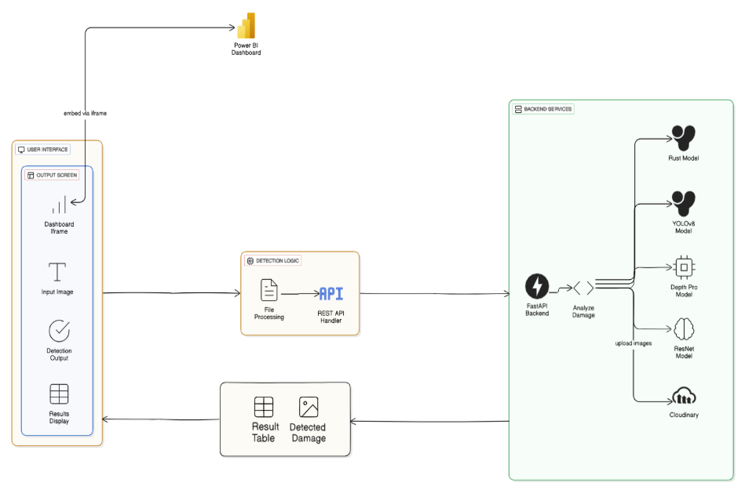

# From 45-Minute Inspection to 30 Seconds — Overbody Damage Detection

An AI-powered computer vision and deep learning system built to automate vehicle exterior damage assessment, physical severity estimation, and professional repair report generation.

---

## 💡 Why This Project Was Built

In the automotive, insurance, rental, and inspection industries, vehicle damage assessment has traditionally been a highly manual, subjective, and slow process:
1. **Subjectivity & Inconsistency:** Two human inspectors or mechanics might evaluate the same scratch or dent differently, leading to disputes or inflated repair quotes.
2. **Lack of Calibration:** Standard 2D photos lack scale and depth. There is no automated way to say "this scratch is exactly 12 cm long" or "this dent is 1.5 cm deep" from a simple photo.
3. **Privacy Risks:** Uploaded vehicle photos often contain EXIF metadata (including GPS coordinates and device identifiers) that leak user/inspector privacy.
4. **Time & Cost:** Creating a structured claim or audit-ready report takes time, requiring manual compilation of annotations, severity measurements, and repair instructions.

### The Solution: Overbody Damage Detection
This platform reduces a standard **45-to-90 minute manual inspection workflow down to less than 30 seconds**. A user uploads a single photo, and the system automatically:
- Localizes and labels damages (scratches, dents, cracks, rust, glass shatter, broken lamps).
- Measures real-world dimensions using a standard credit card as a calibration reference.
- Estimates dent depth using a monocular 3D depth model (Intel MiDaS).
- Classifies severity based on industry-standard rules.
- Identifies the affected vehicle panel and generates an automated repair guide with cost estimates using Gemini 2.5 Flash.
- Exposes a sleek, interactive frontend to view results, measure custom damages, and export reports.

---

## 🗺️ System Architecture

---

## 🛠️ The Tech Stack & Rationale

| Technology | Purpose | Rationale |
| :--- | :--- | :--- |
| **FastAPI** | Asynchronous Python Backend | An asynchronous Python web framework that handles concurrent API requests efficiently while processing heavy AI model inferences in the background. |
| **YOLOv8** | Core Object Detection | A state-of-the-art real-time object detection model fine-tuned to quickly locate and identify vehicle surface defects. |
| **OpenCV Fallback** | Deterministic Visual Processing | A reliable, lightweight fallback processing pipeline using classical computer vision algorithms to detect damages when the primary AI models are offline. |
| **Intel MiDaS** | Monocular 3D Depth | A monocular depth estimation model that infers 3D structural data from a standard 2D image, allowing the system to calculate the depth of dents. |
| **OpenCV Calibration** | Physical Scale Estimation | Translates pixel measurements into physical centimeters using the standard dimensions of a reference object (like a credit card) in the image frame. |
| **Gemini 2.5 Flash** | AI Panel ID & Repair Advice | A multimodal AI model used to identify the affected vehicle panels and generate detailed repair guidance reports. |
| **React + TypeScript + Vite** | Visual Dashboard | A responsive front-end dashboard with an interactive damage slider, custom measurement ruler, and report export tools. |

---

## 📈 Headline Results

*   **Inspection Efficiency (45min → 30sec):** Reduces manual walk-around inspections from 45–90 minutes to under 30 seconds per vehicle by automating detection, measurement, and reporting.
*   **Interactive Custom Ruler:** Enables users to measure arbitrary distances on the vehicle directly from their browser window using the calibrated pixel-to-cm ratio.

---

## 🔒 Engineering Rigor & Security Features

*   **EXIF Metadata Stripping:** Automatically removes GPS coordinates, camera model information, and timestamps from uploaded images to protect user and inspector privacy.
*   **High-Availability Circuit Breaker:** Automatically detects external API issues and transitions to offline, rule-based fallback guidance reports to guarantee 100% server uptime.
*   **Secure Access Controls:** Validates requests using secure, multi-key authentication checks designed to resist timing-attack exploits.
